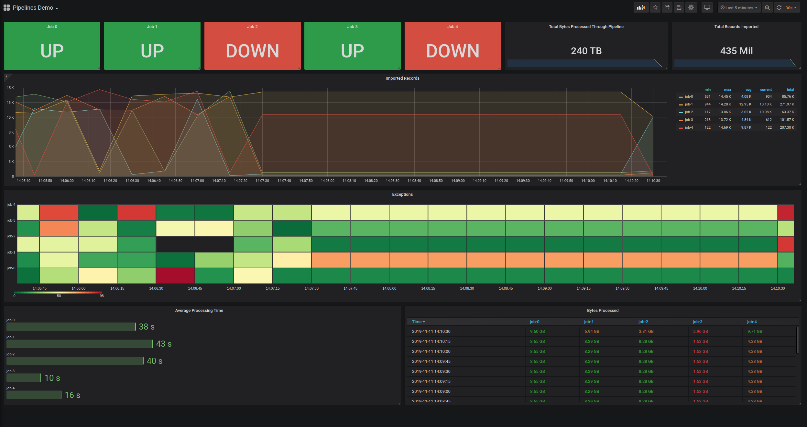

# Prometheus + Grafana Demo



## How to get the entire stack up (using docker)

1) Ensure you have docker-compose installed on your machine, then run:

  ```
  docker-compose up
  ```

2) Go to [localhost:3000](http://localhost:3000)

3) Add prometheus as a datasource using docker DNS name: `prometheus:9090`

4) Import dashboard located [here](.assets/grafana_dashboard.json)

5) Watch the metrics

## How to run just the prometheus exporter (without docker)

1) install dependencies

```
pipenv install
```

2) start the exporter (if you want to see more failures, bump the chaos level to something like .8)

```
pipenv run python demo.py --chaos .2
```

3) view the metrics on [localhost:1234/metrics](http://localhost:1234/metrics)

